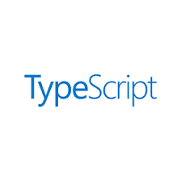

# typescript
Sección que contiene una colección de ejemplos con TypeScript y sus características.

### Proyectos
* Hola Mundo - I
* Hola Mundo - II
* Strings
* Promise
* Objetos - I
* Objetos - II
* Metodos
* Variables (let/const)
* Condicional - If
* Funciones flecha - I
* Funciones flecha - II
* Decoradores - I
* Decoradores - II
* Decoradores - III
