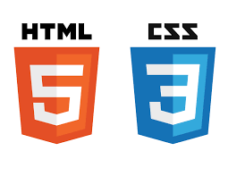

# Css/Html
Sección que contiene una colección de ejemplos en CSS y sus características.

### Colores
* Elementos 1
* Elementos 2
* Codigos/Valor

### Distribucion Web
* Ejemplo de distribucion web con CSS

### Grids
* Column Gap
* Container
* Layout
* Rotacion de texto

### Responsive
* Bootstrap
* Responsive 1
* Responsive 2
* Responsive 3

### Selectores
* Ejemplo con selectores

### Sintaxsis
* Sintaxis 1
* Sintaxis 2
* Sintaxis 3
* Sintaxis 4

### Lightbox
* Ejemplo de Lightbox con CSS3

### Slides
* Ejemplo de slides con imagenes
* Menu Desplegable

### Imagenes
* Galeria de Imagenes 
